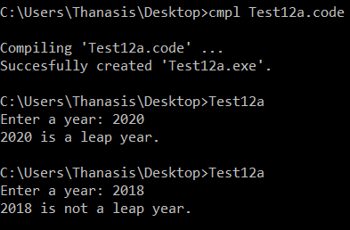
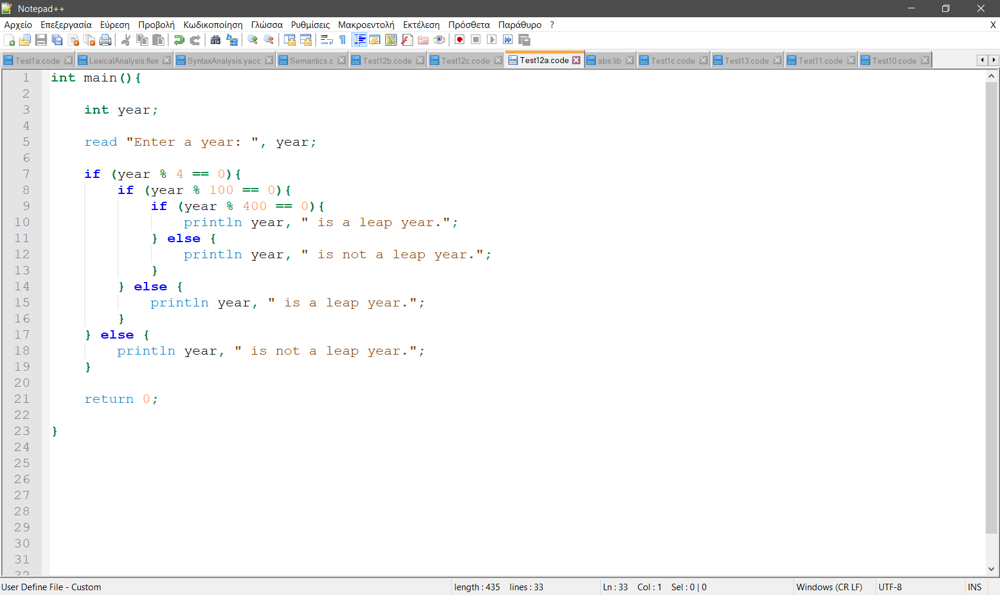

# Compiler for custom language
This repository includes a compiler for a custom language, which was built using flex and byacc. It translates from this custom language to assembly and then creates the executable. This project is an extension of a project from my university on a subject about compilers.

## Index

[Custom Language Syntax](#custom-language-syntax)

[Install and Execute](#install-and-execute)

[Files explained](#files-explained)


## Custom Language Syntax
The syntax of the language is very similar to the syntax of C. It supports 3 types: int, real and char. It also supports functions, arrays, recursion, use of include (if you run the preprocessor), if-else, for, while and more.

The source code can have a section with the **includes** at the beginning. e.g. "include math.lib", this will search in the folder of the source code for a text file named "math.lib" and if it doesn't find it it will search under C://cmpl/lib. If it is not found an error will appear and the process stops. If it is found then it creates a new source code file (Final.code, which will be deleted later) by replacing the include line with the code of the file. The same is done for every include line.

The next section of the source code is made from **functions**. One of these functions must be named "main" from which the execution of the program begins. Functions must have different names or different number and types of parameters. In order to call a function, that function must have already been declared. The functions have this structure: ``return_type function_name(type_of_parameter1 parameter1_name, ...) { function_code; return return_value; }``. The types for the return_type and type_of_parameter are: int, real, char. All function must have a return statement since there isn't void type. If the return value is an array then we use ``[]`` after the return_type. If a parameter is an array then we use ``[]`` after the name of the parameter.

Example:

```c++
real[] reverse(real a[], int length){
  int i;	
  for (i=0; i<length/2; i++){
    a[i], a[length-i-1] = a[length-i-1], a[i];
  }
  return a;
}
```

The **body** of the function consists of 2 parts: the declarations of the variables and the instructions. These parts must be in this order, and not mixed.

**How to declare a variable**: ``variable_type varaible1_name, ...;``
If a variable is an array then we use ``[length_of_array]`` after the name of the variable (only numbers allowed, not expressions or variables). We can also assign a value upon declaration using ``=variable_value``.

Examples:

```c++
real a, b[10], c=15, d=2*12;
char e='a';
int i=0, j=0;
```


**Instructions supported**:

- print and read: 
	- ``print expression1, ...;`` (simply prints)
	- ``println expression1, ...;`` (prints and adds a line break)
    - ``read variable`` (reads from user and assigns the input to the variable)
    - ``read "Message: ", variable`` (reads while printing first a message)

    Examples:
    
    ```c++
    print "5*3.14 equals ", 5*3.14;
    println "Hello World !!!"
    read a[4];
    read "Enter a year: ", year;
    ```
    
    
- if-else:
 
   - ``if (expression) one-line_statement;``
   - ``if (expression) {statements}``
   - ``if (expression) one-line_statement; else one-line_statement;``
   - ``if (expression) one-line_statement; else {statements}``
   - ``if (expression) {statements} else one-line_statement;``
   - ``if (expression) {statements} else {statements}``


    Examples:
    ```c++
    // check for leap year
    if (year % 4 == 0 and ((year % 100 == 0 and year % 400 == 0) or (year % 100 != 0))){
        println year, " is a leap year.";
    } else {
        println year, " is not a leap year.";
	  }
    
    // absolute
    if (num < 0)
      num = 0-num;
    ```
    
    
- while:
 
   - ``while (expression) one-line_statement;``
   - ``while (expression) {statements}`` (you can use ``break;`` to exit the most inner while) 


    Examples:
    ```c++
    // calculate sum of i while i++
    while (true){
      sum += i;
      ++i;
      if (i>limit)
        break;
    }
    
    // calculate GCD of n1 and n2 (result n1)
    while(n1!=n2){
      if (n1 > n2)
        n1 = n1 - n2;
      else
        n2 = n2 - n1;
    }
    ```
    
    
- for:
 
   - ``for (statement; expression; statement) one-line_statement;``
   - ``for (statement; expression; statement) {statements};`` (you can use ``break;`` to exit the most inner for) 


    Examples:
    ```c++
    // print multiplication table
    for (i=1; i<=10; i++){
      for (j=0; j<=10; j++){
        print j, " * ", i, " = ", i*j, ",  ";
      }
      println "";
    }
    
    // example with break
    for (i=0; i<15; i++){
      println i;
      if (i==8)
        break;
    }
    ```
    
    


- repeat n times:
 
   - ``repeat expression times one-line_statement;``
   - ``repeat expression times {statements};`` (you can use ``break;`` to exit the most inner for) 
   
   The expression is calculated at the beginning, so if there is a variable or an expression that uses a variable, and the variable changes inside the loop, the variable's initial value will remain as the counter for the loop.


    Examples:
    ```c++
    // use variable (length)
    repeat length times{
      a[i] = (v+i)*factor;
      i++;
    }
    
    // example with break
    repeat 15 times{
      println i;
      if (i==8)
        break;
      i++;
    }
    ```
    
    

**Operations supported**:

- Arithmetic Operators:

   - Addition (``+``)
   - Substraction (``-``)
   - Multiplication (``*``)
   - Division (``/``)
   - Modulo (``%``)
   - Increment (``i++``,``++i``, like in C)
   - Decrement (``i--``,``--i``, like in C)
   
- Relational Operators:

   - Equality (``==``)
   - Inequality (``!=``)
   - Comparisons (``>``,``>=``,``<``,``<=``)
   
   
- Logical Operators:

   - Negation (``!``)
   - AND (``and``)
   - OR (``or``)
   
- Assignment Operators:

    - Simple assignment (``i = 2``, ``i = j = 0``, ``i, j = 2, 4``, ``i, j = j, i``, like in Python)
    - Assign and operate (``+=``, ``-=``, ``*=``, ``/=``, like in C)


Examples:

```c++
i=j=k=10;
println i, " ", j, " ", k;
i,j,k=1,2,3;
println i, " ", j, " ", k;
i,j=j,i;
println i, " ", j, " ", k;
i+=j+k;
println i, " ", j, " ", k;
if (i>k and j<k){
  println "IN";
  j++;
}
println i, " ", j, " ", k;
if (k-3)
  println "IN2"; // it doesn't execute becuase k=3
```
Output:

```c++
10 10 10
1 2 3
2 1 3
6 1 3
IN
6 2 3
```

## Install and Execute

In order to run the compiler you should follow these steps:

- Download and install the [GCC](https://sourceforge.net/projects/tdm-gcc/) compiler (I used the 5.3.0 version)
- Download and install the [NASM](https://www.nasm.us/pub/nasm/releasebuilds/?C=M;O=D) assembler (I used the [2.13.01 version](https://www.nasm.us/pub/nasm/releasebuilds/2.13.01/win64/))
- Add both programs above to the system's path variable (see instructions [here](https://www.howtogeek.com/118594/how-to-edit-your-system-path-for-easy-command-line-access/))
- Download the folder [Install](Install)
- Copy the folder [cmpl](Install/cmpl) under your C:// folder
- Open cmd and navigate (``cd path``) to the folder with the source code file (you can use one from the [Examples](Examples))
- Let's say you have the Test1.code source file. Execute: ``C:\cmpl\cmpl Test1.code``
- Now, if the compilation was successful, there will be an exe with the same name of the source file (Test1.exe). You can run ``Test1`` and enjoy !!!

If you want to simply compile a source file by executing ``cmpl Test1.code``, you can add the C:\cmpl folder in your system's path variable (see instructions [here](https://www.howtogeek.com/118594/how-to-edit-your-system-path-for-easy-command-line-access/)).



Now if you want to start developing on this wierd language you can use [Notepad++](https://notepad-plus-plus.org/download/) and import the user defined language I created, in order to highlight the reserved words and generally have a better experience while coding. In order to do that you should follow these steps:

- Locate the [npppcl.xml](Install/Notepad++/npppcl.xml) (Notepad++ custom language) file you downloaded.
- Open Notepad++
- From the menu navigate to Language. Scroll to the bottom and click "Define your language..."
- On the dialog that will show up, click on "Import" and select the npppcl.xml file (see also [here](http://docs.notepad-plus-plus.org/index.php/User_Defined_Language_Files#How_to_install_user_defined_language_files) if you have any problems)
- Now you can also associate an extension (e.g. ``.code``) with this imported custom language (for instructions click [here](https://superuser.com/questions/151597/how-can-i-tell-notepad-to-always-use-a-particular-language-with-a-particular-f))
- You are ready to develop !!!




## Files explained

- **Compiler** ([Source code](Source%20Code/Compiler), [Executable](Install/cmpl/Compiler.exe))

  This is where all the magic happens. This is the program that makes the translation from the source file to the assembly code. To pass a file for compilation you can execute ``Compiler < Test1.code`` in cmd. This will generate 2 ``.asm`` files, one with the data (AssemblyData.asm) and one with the code (AssemblyCode.asm). In order to do this translation, we pass through 3 different stages:
  - Lexical Analysis
  
    Here we seperate all the words from the source file by the spaces, and we pass them to the syntax analysis providing the information of what each word/symbol represents. The source code that is repsonsible for this stage is [LexicalAnalysis.flex](Source%20Code/Compiler/LexicalAnalysis.flex). For this stage the [flex](Source%20Code/Compiler/flex.exe) program is necessary.
  
  - Syntax Analysis
  
    On this stage, we get the words with their information, and try to tell if the syntax is according to our language definition, which means that it follows the structure we want. When there is an inconsistency, we output the message "syntax error". Here there is a syntax tree created, which will later be used for the semantic analysis. The source code that is repsonsible for this stage is [SyntaxAnalysis.yacc](Source%20Code/Compiler/SyntaxAnalysis.yacc). For this stage the [yacc](Source%20Code/Compiler/yacc.exe) program is necessary.
  
  - Semantic Analysis
  
    Last but not least, we do the semantic analysis, which includes some extra tests (e.g. if the variable has not been declared, or is redeclared etc.) and the creation of the assembly files. In order to achieve that, we parse the syntax tree that was created during the previous step, and append lines of assembly code to the correct output file. The source code that is repsonsible for this stage is [Semantics.c](Source%20Code/Compiler/Semantics.c).
    
  In order to combine the steps above and create the Compiler.exe, we can run the [CreateCompiler.bat](Source%20Code/Compiler/CreateCompiler.bat), which includes the following lines:
  
  ```
  yacc -dv SyntaxAnalysis.yacc
  flex LexicalAnalysis.flex
  gcc lex.yy.c y.tab.c zyywrap.c Semantics.c -o Compiler.exe
  ```

- **preprocessor** ([Source code](Source%20Code/preprocessor/main.c), [Executable](Install/cmpl/preprocessor.exe))

  This program is necessary for replacing the include lines with the appropriate code and creating the FinalCode.code file (see [includes](#custom-language-syntax) for more). This process occurs recursively for the included files that have other includes. In order to run the preprocessor you can execute ``preprocessor Test1.code`` in cmd.

- **cmpl** ([Source code](Source%20Code/cmpl/main.c), [Executable](Install/cmpl/cmpl.exe))

  This program is the final product. It combines the preprocessor and the Compiler executables, and also creates the final executable. First it executes the preprocessor for the input source file (``preprocessor Test1.code``). It then runs the Compiler for the file that the preprocessor just created (``Compiler C:\cmpl\FinalCode.code``). Then it combines the 2 assembly files in 1 and creates the final assembly file (``copy C:\cmpl\AssemblyData.asm+C:\cmpl\AssemblyCode.asm C:\cmpl\AssemblyFinal.asm > NUL``). From this file, it creates the object file using nasm (``nasm -f win32 C:\cmpl\AssemblyFinal.asm -o C:\cmpl\AssemblyFinal.obj``). Finally, it creates the executable file using gcc (``gcc -m32 -o %s.exe C:\cmpl\AssemblyFinal.obj``). This process is repeated for every source file that you give as input (e.g. running ``cmpl Test1.code Test2.code`` will create 2 executeables - Test1.exe and Test2.exe). In the end, it erases all the intermediate files that are no longer needed. If you wish to see the assembly and other files created in this process, you can execute the steps above manually.

